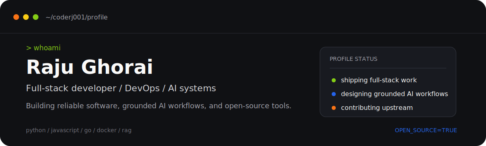

  

  
  
  
  

## The short version

I'm **Raju Ghorai**, a full-stack developer and DevOps engineer focused on building useful software, dependable delivery workflows, and open-source tools.

- **Build:** web products and APIs with Python, JavaScript, Django, React, and Go
- **Operate:** containerized services, cloud infrastructure, databases, and automation
- **Explore:** system design, cloud architecture, developer tooling, and open source

## Tools I reach for

  

  

  

  

## GitHub activity

  
  

  

## Open-source trail

<!--START_SECTION:activity-->
1. ❗ Opened issue [#3936](https://github.com/danny-avila/LibreChat/issues/3936) in [danny-avila/LibreChat](https://github.com/danny-avila/LibreChat)
2. ❗ Opened issue [#1434](https://github.com/vimwiki/vimwiki/issues/1434) in [vimwiki/vimwiki](https://github.com/vimwiki/vimwiki)
3. 🗣 Commented on [#758](https://github.com/Alex313031/thorium/issues/758#issuecomment-2294640299) in [Alex313031/thorium](https://github.com/Alex313031/thorium)
4. 🗣 Commented on [#758](https://github.com/Alex313031/thorium/issues/758#issuecomment-2266533728) in [Alex313031/thorium](https://github.com/Alex313031/thorium)
5. ❗ Opened issue [#758](https://github.com/Alex313031/thorium/issues/758) in [Alex313031/thorium](https://github.com/Alex313031/thorium)
6. 🗣 Commented on [#256](https://github.com/yorukot/superfile/issues/256) in [yorukot/superfile](https://github.com/yorukot/superfile)
7. ❌ Closed PR [#4](https://github.com/coderj001/kickNV/pull/4) in [coderj001/kickNV](https://github.com/coderj001/kickNV)
8. 🗣 Commented on [#8](https://github.com/coderj001/jujutsu-kaisen-api/pull/8#issuecomment-2154208105) in [coderj001/jujutsu-kaisen-api](https://github.com/coderj001/jujutsu-kaisen-api)
9. ❗ Opened issue [#684](https://github.com/Alex313031/thorium/issues/684) in [Alex313031/thorium](https://github.com/Alex313031/thorium)
10. ❗ Opened issue [#3660](https://github.com/fatih/vim-go/issues/3660) in [fatih/vim-go](https://github.com/fatih/vim-go)
<!--END_SECTION:activity-->

  <a href="https://github.com/coderj001?tab=repositories">Browse my repositories -&gt;</a>

